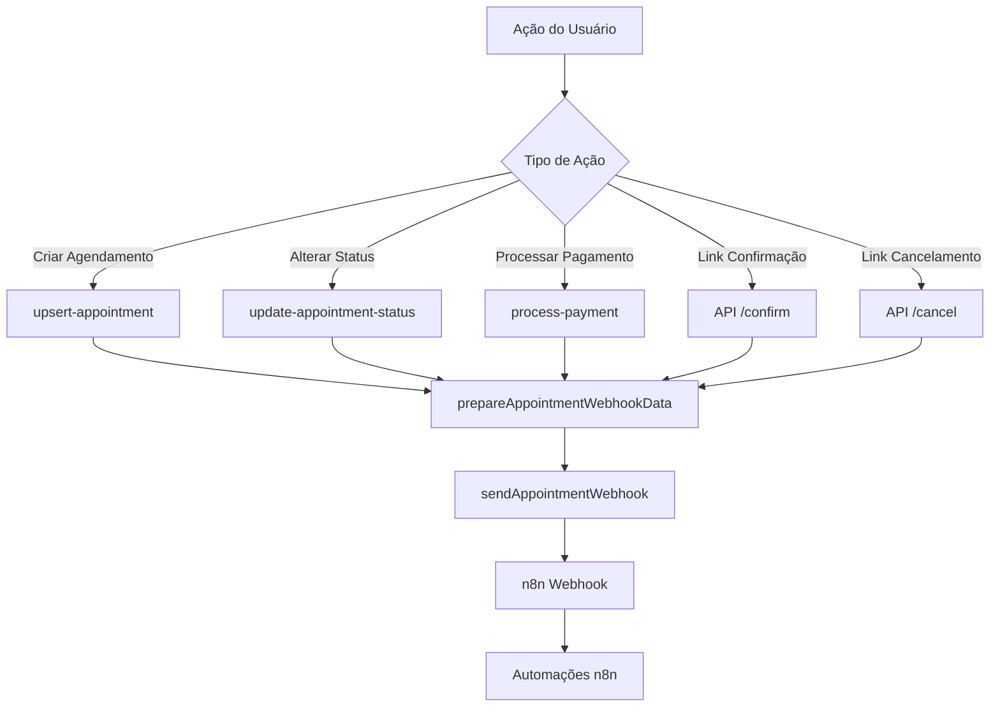

# Integração com n8n - Webhooks de Agendamento

Este documento descreve a integração implementada entre o sistema de agendamentos e o n8n para automação de notificações e processos.

## 📋 Visão Geral

O sistema envia webhooks para o n8n sempre que ocorrem mudanças de status nos agendamentos, permitindo automações como:

- Envio de notificações por WhatsApp/SMS
- Integração com outros sistemas
- Automação de lembretes
- Processos de confirmação e cancelamento

## 🔧 Configuração

### Variável de Ambiente

Adicione no arquivo `.env.local`:

```env
N8N_WEBHOOK_URL=https://novocode-med-n8n.0pdzgw.easypanel.host/webhook-test/22446f9a-817f-493a-a1d7-638d4ce36242
```

### Webhook URL do n8n

O webhook está configurado para receber dados via POST na URL:

```
https://novocode-med-n8n.0pdzgw.easypanel.host/webhook-test/22446f9a-817f-493a-a1d7-638d4ce36242
```

## 📡 Eventos que Disparam Webhooks

### 1. Agendamento Criado (`status: "agendado"`)

**Quando:** Um novo agendamento é criado
**Ação:** `upsert-appointment` (apenas criação)

### 2. Agendamento Confirmado (`status: "confirmado"`)

**Quando:** Status do agendamento é alterado para "confirmado"
**Ação:** `update-appointment-status` ou via API `/api/appointments/[id]/confirm`

### 3. Agendamento Cancelado (`status: "cancelado"`)

**Quando:** Status do agendamento é alterado para "cancelado"
**Ação:** `update-appointment-status` ou via API `/api/appointments/[id]/cancel`

### 4. Pagamento Processado (`status: "pago"`)

**Quando:** Um pagamento é processado com sucesso (status = "pago")
**Ação:** `process-payment`

## 📊 Estrutura dos Dados Enviados

### Payload do Webhook

```json
{
  "event": "appointment_status_change",
  "timestamp": "2024-01-15T14:30:00.000Z",
  "data": {
    "status": "agendado", // "agendado" | "confirmado" | "cancelado" | "pago"
    "appointmentId": "uuid-do-agendamento",
    "patientName": "Nome do Paciente",
    "doctorName": "Dr. Nome do Médico",
    "clinicName": "Nome da Clínica",
    "clinicAddress": "Endereço da Clínica",
    "price": 15000, // valor em centavos
    "appointmentDate": "15/01/2024", // formato DD/MM/YYYY
    "appointmentTime": "14:30", // formato HH:mm
    "confirmUrl": "https://app.com/api/appointments/uuid/confirm",
    "cancelUrl": "https://app.com/api/appointments/uuid/cancel",
    // Campos formatados adicionais
    "priceFormatted": "R$ 150,00",
    "appointmentDateTime": "15/01/2024 14:30"
  }
}
```

### Campos Principais

| Campo             | Tipo   | Descrição                               |
| ----------------- | ------ | --------------------------------------- |
| `status`          | string | Status atual do agendamento             |
| `appointmentId`   | string | UUID único do agendamento               |
| `patientName`     | string | Nome completo do paciente               |
| `doctorName`      | string | Nome completo do médico                 |
| `clinicName`      | string | Nome da clínica                         |
| `clinicAddress`   | string | Endereço completo da clínica            |
| `price`           | number | Valor da consulta em centavos           |
| `appointmentDate` | string | Data no formato brasileiro (DD/MM/YYYY) |
| `appointmentTime` | string | Horário no formato 24h (HH:mm)          |
| `confirmUrl`      | string | URL para confirmação via API            |
| `cancelUrl`       | string | URL para cancelamento via API           |

## 🔗 APIs de Confirmação e Cancelamento

### Confirmar Agendamento

```http
GET /api/appointments/{id}/confirm
```

**Resposta de Sucesso:**

```json
{
  "success": true,
  "message": "Agendamento confirmado com sucesso",
  "appointment": {
    "id": "uuid",
    "status": "confirmado",
    "patient": "Nome do Paciente",
    "doctor": "Dr. Nome",
    "date": "2024-01-15T17:30:00.000Z"
  }
}
```

### Cancelar Agendamento

```http
GET /api/appointments/{id}/cancel
```

**Resposta de Sucesso:**

```json
{
  "success": true,
  "message": "Agendamento cancelado com sucesso",
  "appointment": {
    "id": "uuid",
    "status": "cancelado",
    "patient": "Nome do Paciente",
    "doctor": "Dr. Nome",
    "date": "2024-01-15T17:30:00.000Z"
  }
}
```

## 🏗️ Arquitetura da Integração

### Componentes Principais

1. **`src/helpers/n8n-webhook.ts`**

   - Função `sendAppointmentWebhook()`: Envia dados para o webhook
   - Função `prepareAppointmentWebhookData()`: Prepara e formata os dados
   - Interface `AppointmentWebhookData`: Define a estrutura dos dados

2. **Server Actions Modificadas:**

   - `src/actions/upsert-appointment/index.ts`: Webhook para novos agendamentos
   - `src/actions/update-appointment-status/index.ts`: Webhook para mudanças de status
   - `src/actions/process-payment/index.ts`: Webhook para pagamentos processados

3. **APIs de Confirmação/Cancelamento:**
   - `src/app/api/appointments/[id]/confirm/route.ts`
   - `src/app/api/appointments/[id]/cancel/route.ts`

### Fluxo de Dados



## ⚠️ Tratamento de Erros

- **Webhook indisponível**: O sistema registra um warning mas não falha a operação principal
- **Timeout**: Webhook é executado de forma assíncrona para não impactar a UX
- **Dados incompletos**: Validação prévia garante que todos os campos obrigatórios estejam presentes

## 🔒 Segurança

- **LGPD**: Apenas dados necessários são enviados
- **Logs**: Todas as tentativas de webhook são registradas para auditoria
- **Fallback**: Sistema continua funcionando mesmo se o webhook falhar

## 🧪 Testes

### Testar Webhook Manualmente

```bash
curl -X POST https://novocode-med-n8n.0pdzgw.easypanel.host/webhook-test/22446f9a-817f-493a-a1d7-638d4ce36242 \
  -H "Content-Type: application/json" \
  -d '{
    "event": "appointment_status_change",
    "timestamp": "2024-01-15T14:30:00.000Z",
    "data": {
      "status": "agendado",
      "appointmentId": "test-123",
      "patientName": "Paciente Teste",
      "doctorName": "Dr. Teste",
      "clinicName": "Clínica Teste",
      "clinicAddress": "Rua Teste, 123",
      "price": 15000,
      "appointmentDate": "15/01/2024",
      "appointmentTime": "14:30"
    }
  }'
```

### Monitoramento

Os logs do webhook aparecem no console do servidor Next.js:

- ✅ `Webhook enviado com sucesso para n8n`
- ❌ `Erro ao enviar webhook n8n: [detalhes]`
- ⚠️ `N8N_WEBHOOK_URL não está configurada no ambiente`

## 📈 Métricas e Monitoramento

O sistema registra:

- Tentativas de envio de webhook
- Sucessos e falhas
- Tempo de resposta do n8n
- Tipos de eventos mais frequentes

Todos os logs seguem o padrão de auditoria LGPD para rastreabilidade completa.
