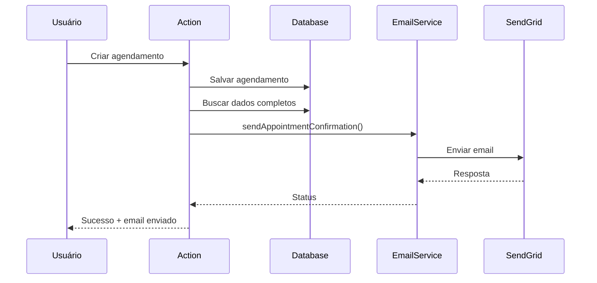
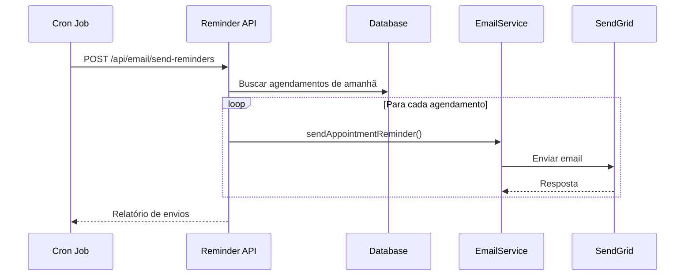

# 📧 Sistema de Email - SendGrid Integration

Este documento descreve a implementação completa do sistema de notificações por email usando SendGrid no Doutor Agenda.

## 🚀 Configuração Inicial

### 1. Pré-requisitos

- Conta no [SendGrid](https://sendgrid.com/)
- API Key do SendGrid configurada
- Domínio verificado (recomendado para produção)

### 2. Configuração das Variáveis de Ambiente

Adicione as seguintes variáveis ao seu arquivo `.env`:

```bash
# SendGrid Configuration
SENDGRID_API_KEY=your_sendgrid_api_key_here
SENDGRID_FROM_EMAIL=noreply@yourdomain.com
SENDGRID_FROM_NAME="Doutor Agenda"

# Application URLs
NEXT_PUBLIC_APP_URL=http://localhost:3000

# Optional: Cron API Key for security
CRON_API_KEY=your_secure_cron_key_here
```

### 3. Obtendo API Key do SendGrid

1. Acesse [SendGrid Console](https://app.sendgrid.com/)
2. Vá para **Settings** > **API Keys**
3. Clique em **Create API Key**
4. Escolha **Full Access** ou configure permissões específicas
5. Copie a chave gerada

### 4. Verificação de Domínio (Produção)

Para melhor deliverability em produção:

1. No SendGrid, vá para **Settings** > **Sender Authentication**
2. Configure **Domain Authentication**
3. Adicione os registros DNS necessários
4. Aguarde verificação

## 📋 Funcionalidades Implementadas

### 1. Templates de Email Disponíveis

- ✅ **Confirmação de Agendamento**: Enviado quando uma consulta é marcada
- ✅ **Lembrete 24h**: Enviado 24 horas antes da consulta
- ✅ **Cancelamento**: Enviado quando uma consulta é cancelada
- ✅ **Reagendamento**: Enviado quando uma consulta é alterada

### 2. Arquivos Criados

```
src/
├── lib/
│   ├── sendgrid.ts              # Configuração base do SendGrid
│   ├── email-templates.ts       # Templates HTML responsivos
│   └── email-service.ts         # Serviço principal de emails
├── app/api/email/
│   ├── test/route.ts           # API para testes de email
│   └── send-reminders/route.ts # API para lembretes 24h
└── actions/
    ├── upsert-appointment/index.ts  # Integração com criação
    └── delete-appointment/index.ts  # Integração com cancelamento
```

## 🧪 Testando o Sistema

### 1. Teste de Conexão

```bash
# GET - Verificar status da API
curl http://localhost:3000/api/email/test

# POST - Testar conexão SendGrid
curl -X POST http://localhost:3000/api/email/test \
  -H "Content-Type: application/json" \
  -d '{"type": "connection", "email": "seu@email.com"}'
```

### 2. Testes de Templates

```bash
# Teste de confirmação
curl -X POST http://localhost:3000/api/email/test \
  -H "Content-Type: application/json" \
  -d '{"type": "confirmation", "email": "teste@email.com"}'

# Teste de lembrete
curl -X POST http://localhost:3000/api/email/test \
  -H "Content-Type: application/json" \
  -d '{"type": "reminder", "email": "teste@email.com"}'

# Teste de cancelamento
curl -X POST http://localhost:3000/api/email/test \
  -H "Content-Type: application/json" \
  -d '{"type": "cancellation", "email": "teste@email.com"}'

# Teste de reagendamento
curl -X POST http://localhost:3000/api/email/test \
  -H "Content-Type: application/json" \
  -d '{"type": "update", "email": "teste@email.com"}'
```

### 3. Teste de Lembretes 24h

```bash
# GET - Status dos lembretes
curl http://localhost:3000/api/email/send-reminders

# POST - Executar envio de lembretes
curl -X POST http://localhost:3000/api/email/send-reminders \
  -H "Authorization: Bearer your_cron_key"
```

## ⚡ Fluxo de Funcionamento

### 1. Criação de Agendamento



### 2. Lembretes 24h



## 🔄 Configuração de Cron Jobs

### 1. Vercel (Recomendado)

Crie um arquivo `vercel.json`:

```json
{
  "crons": [
    {
      "path": "/api/email/send-reminders",
      "schedule": "0 9 * * *"
    }
  ]
}
```

### 2. Cron Service Externo

Use serviços como:

- [Cron-job.org](https://cron-job.org/)
- [EasyCron](https://www.easycron.com/)
- [GitHub Actions](https://docs.github.com/en/actions)

Exemplo de configuração:

```bash
# Executar todo dia às 9:00
0 9 * * * curl -X POST https://seu-dominio.com/api/email/send-reminders \
  -H "Authorization: Bearer your_cron_key"
```

## 📊 Monitoramento

### 1. Logs do Sistema

Os emails geram logs detalhados:

```bash
# Sucesso
✅ Email enviado com sucesso!
📧 Enviando email para: paciente@email.com
📋 Assunto: 🩺 Consulta Confirmada - Dr. João Silva

# Falha
❌ Erro ao enviar email: SendGrid API Error
⚠️ SendGrid API Key não configurada
```

### 2. Dashboard SendGrid

Monitore no [SendGrid Dashboard](https://app.sendgrid.com/):

- Taxa de entrega
- Bounces e spam
- Estatísticas de abertura
- Cliques em links

## 🛡️ Segurança

### 1. Validações Implementadas

- ✅ Email format validation
- ✅ Autenticação obrigatória para APIs
- ✅ Rate limiting entre emails
- ✅ Sanitização de dados

### 2. Melhores Práticas

- Use HTTPS em produção
- Configure SPF, DKIM e DMARC
- Monitore reputação do domínio
- Implemente unsubscribe compliance

## 🚨 Troubleshooting

### 1. Email não enviado

```bash
# Verificar configuração
curl http://localhost:3000/api/email/test

# Verificar logs
npm run dev
# Procurar por "❌" nos logs
```

### 2. Problemas Comuns

| Problema            | Causa                  | Solução                     |
| ------------------- | ---------------------- | --------------------------- |
| API Key inválida    | Chave incorreta        | Verificar `.env`            |
| Email vai para spam | Domínio não verificado | Configurar autenticação     |
| Rate limit          | Muitos emails rápidos  | Aumentar delay entre envios |
| Template quebrado   | Dados inválidos        | Verificar logs de erro      |

### 3. Códigos de Status SendGrid

- `202`: Email aceito
- `400`: Dados inválidos
- `401`: API Key inválida
- `403`: Permissões insuficientes
- `429`: Rate limit excedido

## 📈 Estatísticas de Performance

### 1. Métricas Importantes

- **Taxa de Entrega**: > 95%
- **Taxa de Abertura**: 20-30%
- **Taxa de Spam**: < 1%
- **Tempo de Envio**: < 5 segundos

### 2. Otimizações

- Delay de 100-200ms entre emails
- Batch processing para grandes volumes
- Retry automático em falhas temporárias
- Validação de email antes do envio

## 🔧 Configurações Avançadas

### 1. Customização de Templates

Para personalizar templates, edite `src/lib/email-templates.ts`:

```typescript
// Exemplo de customização
const customTemplate = (data: AppointmentEmailData) => {
  return {
    subject: `Sua consulta com ${data.doctorName}`,
    html: `<h1>Olá ${data.patientName}!</h1>...`,
  };
};
```

### 2. Múltiplos Ambientes

```bash
# Desenvolvimento
SENDGRID_FROM_EMAIL=dev@yourdomain.com

# Produção
SENDGRID_FROM_EMAIL=noreply@yourdomain.com
```

### 3. A/B Testing

Implemente variações de templates:

```typescript
const templateVariation = Math.random() > 0.5 ? "A" : "B";
const template =
  templateVariation === "A" ? createTemplateA(data) : createTemplateB(data);
```

## 📝 Changelog

### v1.0.0 (Inicial)

- ✅ Configuração base SendGrid
- ✅ Templates HTML responsivos
- ✅ Sistema de confirmação
- ✅ Lembretes 24h
- ✅ Cancelamentos
- ✅ API de testes
- ✅ Documentação completa

### Próximas Features

- 🔄 Lembretes em horários customizáveis
- 📱 Templates para SMS
- 📊 Dashboard de métricas
- 🎨 Editor visual de templates
- 🌐 Múltiplos idiomas

---

## 🆘 Suporte

Para dúvidas ou problemas:

1. Consulte os logs do sistema
2. Verifique a documentação do SendGrid
3. Teste as APIs individualmente
4. Monitore métricas de entrega

**Documentação SendGrid**: https://docs.sendgrid.com/
**Status Page**: https://status.sendgrid.com/
